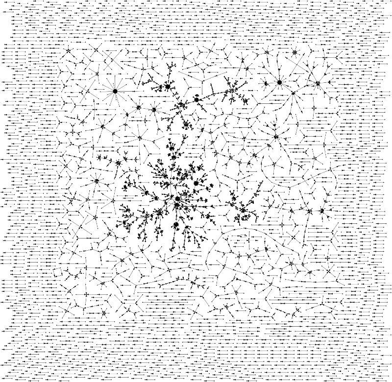

# Experiment with creation of Graphs from Wikidata content

Choose a property, e.g. [P184](http://www.wikidata.org/entity/P184) that
connects PhD student and supervisor.

Query all edges and node labels with [wdq](https://metacpan.org/pod/distribution/App-wdq/script/wdq):

    wdq --label a,b --ids --format ldjson  '?a wdt:P184 ?b' > P184.ldjson

You may want/neet to add option `--language en` to select English or choose
another language.

Now generate a DOT file for GraphViz:

    ./ldjson2dot.pl < P184.ldjson > P184.dot

with this script

```perl
#!/usr/bin/perl
use v5.14;
use JSON;
my %node;
binmode(STDOUT,':utf8');
say "digraph {";
say " node[shape=point]";
while (<>) {
    my $edge = decode_json($_);
    foreach (grep { !$node{$edge->{$_}} } qw(a b)) {
#        say $edge->{$_}, '[label="', $edge->{$_.'Label'}, '"]';
    }
    say $edge->{a}, ' -> ', $edge->{b};
}
say "}";
```

Finally generate a SVG file and hope it makes sense (this may take some time depending on size of the graph):

    sfdp -Tsvg P184.dot -o P184.svg

Here is an image of my first result, a graph with 4409 edges:



Now switch to some more sophisticated network analysis software...

